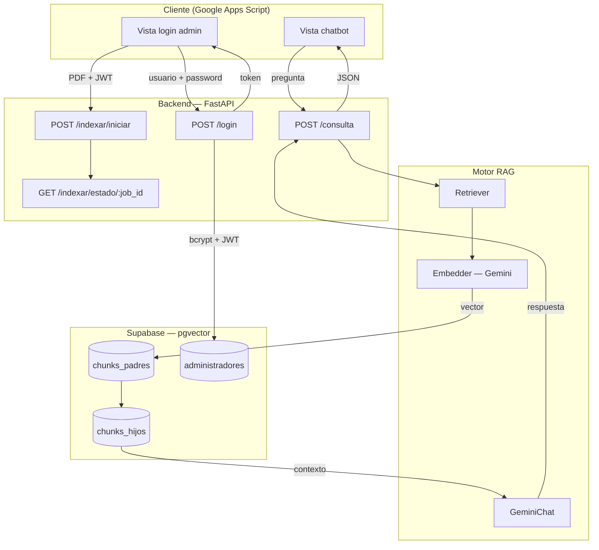
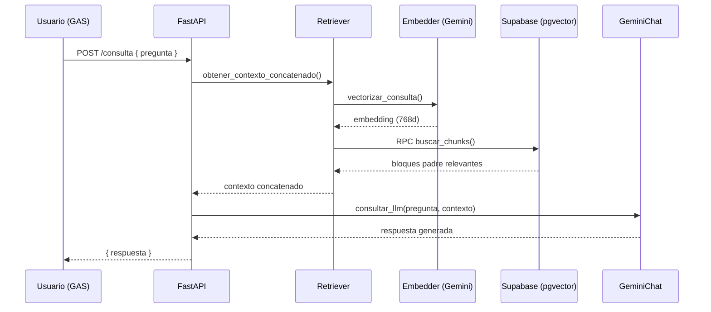

Usar el siguiente comando para instalar las dependencias del proyecto:

pip install -r requirements.txt

Comando para ejecutar API:

python -m uvicorn app:app --reload

<div align="center">

# Chatbot PUI — Asistente Virtual DGAIR-SIGED

**Asistente conversacional basado en RAG para resolver dudas sobre la Plataforma Única de Identidad (PUI)**

[](https://www.python.org/)
[](https://fastapi.tiangolo.com/)
[](https://supabase.com/)
[](https://ai.google.dev/)
[](https://developers.google.com/apps-script)
[]()

</div>

---

## 📋 Tabla de contenidos

- [Sobre el proyecto](#-sobre-el-proyecto)
- [¿Qué es RAG?](#-qué-es-rag-generación-aumentada-por-recuperación)
- [Arquitectura](#-arquitectura)
- [Stack tecnológico](#-stack-tecnológico)
- [Estructura del proyecto](#-estructura-del-proyecto)
- [Endpoints de la API](#-endpoints-de-la-api)
- [Autenticación de administradores](#-autenticación-de-administradores)
- [Puesta en marcha local](#-puesta-en-marcha-local)
- [Variables de entorno](#-variables-de-entorno)
- [Despliegue](#-despliegue)
- [Roadmap](#-roadmap)
- [Capturas y pruebas](#-capturas-y-pruebas)
- [Origen del proyecto](#-origen-del-proyecto)
- [Licencia](#-licencia)

---

## 🎯 Sobre el proyecto

Este chatbot resuelve dudas frecuentes sobre la **Plataforma Única de Identidad (PUI)**, un trámite gubernamental dirigido a Instituciones Particulares de Educación Superior (IPES). En lugar de que el usuario tenga que buscar entre reglamentos, guías de procedimiento y comunicados oficiales, el asistente responde en lenguaje natural, fundamentando cada respuesta exclusivamente en la documentación oficial vigente.

El sistema no entrena ningún modelo de inteligencia artificial desde cero. En su lugar, adopta la arquitectura **RAG (Retrieval-Augmented Generation)**: combina una base de conocimiento vectorial propia —construida a partir de los PDFs oficiales— con un modelo de lenguaje preentrenado consumido vía API. Esto permite respuestas precisas, actualizables en minutos y con costo de operación prácticamente nulo.

**Dentro del alcance:**
- Responder preguntas frecuentes sobre el Programa de Cumplimiento PUI.
- Informar sobre requisitos, plazos y procedimientos.
- Operar de forma continua (24/7) sin intervención humana.
- Fundamentar todas las respuestas exclusivamente en documentación oficial.
- Permitir a un administrador actualizar la base de conocimiento subiendo nuevos PDFs, sin tocar código.

**Fuera del alcance:**
- Realizar trámites de forma automatizada (el chatbot informa, no gestiona).
- Acceder a datos personales o expedientes de las instituciones.
- Sustituir la atención oficial del área responsable.

---

## 🧠 ¿Qué es RAG (Generación Aumentada por Recuperación)?

RAG combina dos capacidades: recuperar información relevante de una base de datos propia y generar texto coherente con un modelo de lenguaje. Cada vez que alguien pregunta, ocurren tres etapas:

| Etapa | Descripción |
|---|---|
| **1. Recuperación** | Se buscan los fragmentos del documento más relacionados con la pregunta usando similitud semántica (embeddings). |
| **2. Aumentación** | Los fragmentos encontrados se añaden al mensaje enviado al modelo como contexto adicional. |
| **3. Generación** | El modelo redacta la respuesta apoyándose en ese contexto, sin inventar información fuera de él. |

Esto evita dos problemas clásicos de los LLM: **alucinaciones** (inventar respuestas) e **información desactualizada** — al obligar al modelo a fundamentar sus respuestas en documentos verificables que se pueden actualizar sin reentrenar nada.

---

## 🏗️ Arquitectura

El sistema se divide en dos subsistemas independientes:

- **Indexador** — proceso administrativo que carga o actualiza la base de conocimiento (PDFs → texto → chunks → embeddings → Supabase). No interviene en cada consulta del usuario.
- **Flujo de consulta** — se ejecuta cada vez que alguien hace una pregunta al chatbot.



### Flujo de una consulta



La búsqueda usa **similitud coseno** con `DISTINCT ON` para evitar que un mismo documento aparezca repetido, y un umbral mínimo de similitud calibrado empíricamente para filtrar resultados irrelevantes sin descartar preguntas legítimas.

---

## 🛠️ Stack tecnológico

| Componente | Tecnología | Función |
|---|---|---|
| **Frontend** | Google Apps Script (HTML/CSS/JS) | Interfaz de chat y panel de administración, embebidos en el ecosistema institucional |
| **Backend** | Python + FastAPI | Orquestación de la lógica RAG y autenticación |
| **Modelo de IA** | Google Gemini (vía API) | Generación de respuestas en lenguaje natural |
| **Embeddings** | Gemini Embeddings (768 dimensiones) | Vectorización de documentos y consultas |
| **Base vectorial** | PostgreSQL + pgvector (Supabase) | Almacenamiento y búsqueda semántica |
| **Autenticación** | JWT + bcrypt | Sesión de administradores para gestionar la base de conocimiento |
| **Control de versiones** | Git + GitHub | Gestión del código fuente (GitHub Flow) |
| **Gestión del proyecto** | Jira (tablero Kanban) | Organización en Épicas e historias de usuario |
| **Hosting (planeado)** | Render (capa gratuita) | Despliegue del backend con keep-alive externo |

> Todo el stack se apoya en capas gratuitas, siguiendo la misma filosofía de costo-cero del proyecto original.

---

## 📁 Estructura del proyecto

```
chatbot-pui/
├── app.py                       # FastAPI — endpoints de la API
├── auth.py                      # Login, hashing y verificación de JWT
├── gemini_chat.py                # Prompt y llamada al modelo de lenguaje
├── embedder.py                   # Generación de embeddings (768d)
├── requirements.txt
├── keys.env                      # Variables de entorno (no versionado)
│
├── database/
│   ├── supabase_client.py        # Cliente de conexión a Supabase
│   ├── retriever.py               # Búsqueda semántica (RPC buscar_chunks)
│   └── insertar_supabase.py       # Inserción de chunks + embeddings
│
├── indexador/
│   ├── extractor_pdf.py           # Extracción y limpieza de texto de PDFs
│   ├── chunker.py                 # División padre-hijo del texto
│   └── indexar_pdf.py             # Orquestación del pipeline de indexación
│
└── vista/                         # Prototipo local de la vista (referencia)
    ├── index.html
    ├── styles.css
    └── script.js
```

> La versión desplegada de la vista vive dentro de **Google Apps Script** (no en este repositorio), como archivos `.html` independientes que consumen esta API.

---

## 🔌 Endpoints de la API

| Método | Endpoint | Protegido | Descripción |
|---|---|:---:|---|
| `POST` | `/consulta` | No | Recibe una pregunta y devuelve la respuesta generada por RAG |
| `POST` | `/login` | No* | Valida credenciales de administrador y devuelve un JWT |
| `GET` | `/admin/verificar` | ✅ JWT | Verifica que una sesión de administrador es válida |
| `POST` | `/indexar/iniciar` | 🚧 Planeado | Sube un PDF y dispara la indexación en segundo plano |
| `GET` | `/indexar/estado/{job_id}` | 🚧 Planeado | Consulta el progreso de un trabajo de indexación |
| `GET` | `/ping` | 🚧 Planeado | Endpoint de salud para el keep-alive del hosting gratuito |

`*` `/login` no requiere token, pero está protegido contra fuerza bruta con **rate limiting** (5 intentos cada 5 minutos por IP).

La documentación interactiva (Swagger UI) está disponible en `/docs` cuando el servidor corre localmente o en producción.

---

## 🔐 Autenticación de administradores

Los administradores (quienes pueden actualizar la base de conocimiento) se autentican mediante un flujo JWT:

1. Las contraseñas se almacenan **hasheadas con bcrypt** en la tabla `administradores` de Supabase — nunca en texto plano.
2. `POST /login` valida las credenciales y, si son correctas, devuelve un token JWT firmado con expiración de 8 horas.
3. Los endpoints protegidos exigen el header `Authorization: Bearer <token>`, validado por una dependencia de FastAPI (`obtener_admin_actual`).
4. La tabla `administradores` **no está expuesta** a la API pública de Supabase (permisos revocados para el rol `anon`); solo el backend, usando la *secret key*, puede leerla.

---

## 💻 Puesta en marcha local

**Requisitos:** Python 3.11+, una cuenta de Supabase y una API key de Google Gemini.

```bash
# 1. Clonar el repositorio
git clone https://github.com/tu-usuario/chatbot-pui.git
cd chatbot-pui

# 2. Instalar dependencias
pip install -r requirements.txt

# 3. Configurar variables de entorno (ver sección siguiente)
cp keys.env.example keys.env

# 4. Levantar el servidor
python -m uvicorn app:app --reload
```

Con el servidor corriendo, abre `http://127.0.0.1:8000/docs` para probar todos los endpoints desde Swagger UI sin necesidad de ninguna vista.

---

## 🔑 Variables de entorno

Crear un archivo `keys.env` en la raíz del proyecto con:

```env
SUPABASE_URL=https://tu-proyecto.supabase.co
SUPABASE_KEY=tu_secret_key_de_supabase

GEMINI_API_KEY=tu_api_key_de_gemini

JWT_SECRET=una_clave_larga_generada_aleatoriamente
```

> `JWT_SECRET` se genera una sola vez con: `python -c "import secrets; print(secrets.token_hex(32))"`

---

## 🚀 Despliegue

**Estado actual:** en desarrollo local, pendiente de despliegue.

Arquitectura de despliegue planeada:

```
Google Apps Script (vista + botón de acceso)
        │
        ▼
   Render (FastAPI + vista estática, un solo servicio)
        │
        ▼
   Supabase (pgvector)
        ▲
        │
cron-job.org — ping periódico a /ping para evitar
la suspensión por inactividad de la capa gratuita
```

Todo el backend se aloja en un único servicio de Render para evitar CORS innecesario y mantener un solo dominio.

---

## 🗺️ Roadmap

- [x] Adaptar el proyecto base (chatbot UPIICSA) a un nuevo repositorio independiente
- [x] Provisionar un nuevo proyecto de Supabase con las tablas del RAG + tabla de administradores
- [x] Implementar autenticación de administradores (bcrypt + JWT + rate limiting)
- [x] Construir la vista de chat y de login en Google Apps Script
- [ ] Adaptar el dominio del asistente (system prompt, preguntas frecuentes reales de la PUI)
- [ ] Implementar el endpoint de indexación con subida de PDF desde la vista (job asíncrono)
- [ ] Construir el panel de administración post-login en GAS
- [ ] Desplegar el backend en Render
- [ ] Configurar keep-alive externo y restringir CORS a los dominios de producción
- [ ] Conectar la vista de producción de GAS al chatbot desplegado

---

## 📸 Capturas y pruebas

> *Sección pendiente de completar una vez desplegado el proyecto en Google Apps Script.*

<!--
Agregar aquí:
- Captura de la vista principal con el botón de acceso al chatbot
- Captura de una conversación real con el chatbot
- Captura del panel de login de administrador
- Captura del panel de administración (subida e indexación de PDFs)
- Protocolo de pruebas: preguntas reales utilizadas y evaluación de las respuestas
-->

---

## 🎓 Origen del proyecto

Este proyecto es una adaptación del **Chatbot de Apoyo para el Servicio Social en UPIICSA**, desarrollado originalmente como Trabajo Terminal del Instituto Politécnico Nacional por Josgua Tadeo Choreño Arenas, Gael Dali Cruz Cordero y Sebastián García Martínez, bajo la asesoría de la Dra. Lilia González Arroyo. Conserva la arquitectura RAG original y la adapta a un nuevo dominio de información (la Plataforma Única de Identidad) y a un nuevo entorno de despliegue (Google Apps Script).

---

## 📄 Licencia

> *Pendiente de definir.*

