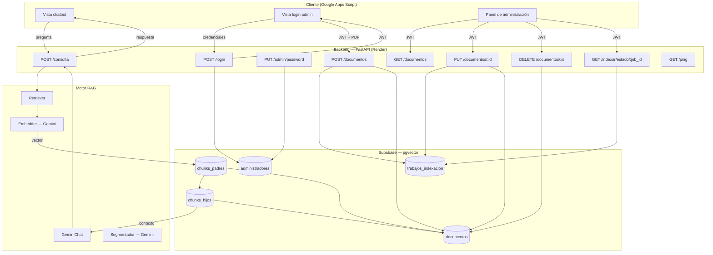
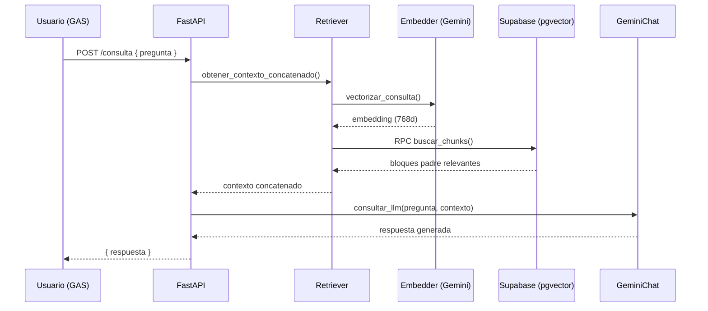
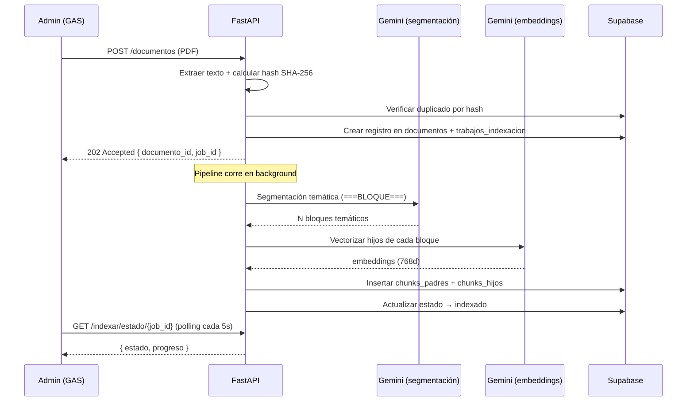

Usar el siguiente comando para instalar las dependencias del proyecto:

pip install -r requirements.txt

Comando para ejecutar API:

python -m uvicorn app:app --reload

<div align="center">

# Chatbot PUI — Asistente Virtual DGAIR-SIGED

**Asistente conversacional basado en RAG para resolver dudas sobre la Plataforma Única de Identidad (PUI)**

[](https://www.python.org/)
[](https://fastapi.tiangolo.com/)
[](https://supabase.com/)
[](https://ai.google.dev/)
[](https://developers.google.com/apps-script)
[](https://chatbot-pui-api.onrender.com)
[]()

</div>

---

## 📋 Tabla de contenidos

- [Sobre el proyecto](#-sobre-el-proyecto)
- [¿Qué es RAG?](#-qué-es-rag-generación-aumentada-por-recuperación)
- [Arquitectura](#-arquitectura)
- [Stack tecnológico](#-stack-tecnológico)
- [Estructura del proyecto](#-estructura-del-proyecto)
- [Esquema de base de datos](#-esquema-de-base-de-datos)
- [Endpoints de la API](#-endpoints-de-la-api)
- [Autenticación de administradores](#-autenticación-de-administradores)
- [Pipeline de indexación](#-pipeline-de-indexación)
- [Puesta en marcha local](#-puesta-en-marcha-local)
- [Variables de entorno](#-variables-de-entorno)
- [Despliegue](#-despliegue)
- [Roadmap](#-roadmap)
- [Capturas y pruebas](#-capturas-y-pruebas)
- [Origen del proyecto](#-origen-del-proyecto)
- [Licencia](#-licencia)

---

## 🎯 Sobre el proyecto

Este chatbot resuelve dudas frecuentes sobre la **Plataforma Única de Identidad (PUI)**, un trámite gubernamental dirigido a Instituciones Particulares de Educación Superior (IPES). En lugar de que el usuario tenga que buscar entre reglamentos, guías de procedimiento y comunicados oficiales, el asistente responde en lenguaje natural, fundamentando cada respuesta exclusivamente en la documentación oficial vigente.

El sistema no entrena ningún modelo de inteligencia artificial desde cero. En su lugar, adopta la arquitectura **RAG (Retrieval-Augmented Generation)**: combina una base de conocimiento vectorial propia —construida a partir de los PDFs oficiales— con un modelo de lenguaje preentrenado consumido vía API. Esto permite respuestas precisas, actualizables en minutos y con costo de operación prácticamente nulo.

**Dentro del alcance:**
- Responder preguntas frecuentes sobre el Programa de Cumplimiento PUI.
- Informar sobre requisitos, plazos y procedimientos.
- Operar de forma continua (24/7) sin intervención humana.
- Fundamentar todas las respuestas exclusivamente en documentación oficial.
- Permitir a un administrador actualizar la base de conocimiento subiendo nuevos PDFs desde el panel web, sin tocar código.

**Fuera del alcance:**
- Realizar trámites de forma automatizada (el chatbot informa, no gestiona).
- Acceder a datos personales o expedientes de las instituciones.
- Sustituir la atención oficial del área responsable.

---

## 🧠 ¿Qué es RAG (Generación Aumentada por Recuperación)?

RAG combina dos capacidades: recuperar información relevante de una base de datos propia y generar texto coherente con un modelo de lenguaje. Cada vez que alguien pregunta, ocurren tres etapas:

| Etapa | Descripción |
|---|---|
| **1. Recuperación** | Se buscan los fragmentos del documento más relacionados con la pregunta usando similitud semántica (embeddings). |
| **2. Aumentación** | Los fragmentos encontrados se añaden al mensaje enviado al modelo como contexto adicional. |
| **3. Generación** | El modelo redacta la respuesta apoyándose en ese contexto, sin inventar información fuera de él. |

Esto evita dos problemas clásicos de los LLM: **alucinaciones** (inventar respuestas) e **información desactualizada** — al obligar al modelo a fundamentar sus respuestas en documentos verificables que se pueden actualizar sin reentrenar nada.

---

## 🏗️ Arquitectura

El sistema se divide en dos subsistemas independientes:

- **Indexador** — proceso que carga o actualiza la base de conocimiento (PDFs → extracción → segmentación temática con Gemini → chunks → embeddings → Supabase). Se ejecuta vía panel de administración o script local.
- **Flujo de consulta** — se ejecuta en tiempo real cada vez que un usuario hace una pregunta al chatbot.



### Flujo de una consulta



### Flujo de indexación de un PDF



La búsqueda usa **similitud coseno** con `DISTINCT ON` para evitar que un mismo documento aparezca repetido, y un umbral mínimo de similitud calibrado empíricamente para filtrar resultados irrelevantes.

---

## 🛠️ Stack tecnológico

| Componente | Tecnología | Función |
|---|---|---|
| **Frontend** | Google Apps Script (HTML/CSS/JS) | Interfaz de chat y panel de administración |
| **Backend** | Python 3.11 + FastAPI | Orquestación de la lógica RAG, autenticación y endpoints de gestión |
| **Modelo de lenguaje** | Google Gemini (vía API) | Generación de respuestas y segmentación temática de documentos |
| **Embeddings** | Gemini Embeddings (768 dimensiones) | Vectorización de documentos y consultas |
| **Base vectorial** | PostgreSQL + pgvector (Supabase) | Almacenamiento y búsqueda semántica de chunks |
| **Autenticación** | JWT + bcrypt + slowapi | Sesión de administradores con rate limiting en login |
| **Hosting** | Render (free tier) | Despliegue del backend con keep-alive vía cron-job.org |
| **Keep-alive** | cron-job.org | Ping periódico a `/ping` para evitar suspensión por inactividad |
| **Control de versiones** | Git + GitHub (GitHub Flow) | Gestión del código fuente con feature branches |
| **Gestión del proyecto** | Jira (Kanban, prefijo `CHTPUI-`) | Épicas, historias y seguimiento de tickets |

> Todo el stack opera sobre capas gratuitas, manteniendo costo de operación cero.

---

## 📁 Estructura del proyecto

```
chatbot-pui/
├── app.py                        # FastAPI — todos los endpoints
├── auth.py                       # Login, bcrypt, JWT, rate limiting
├── pipeline.py                   # Lógica de indexación (alta y actualización)
├── gemini_chat.py                # System prompt y llamada al LLM
├── embedder.py                   # Vectorización de textos (768d)
├── requirements.txt
├── keys.env                      # Variables de entorno (no versionado)
├── generar_admin.py              # Script para crear el primer administrador
│
├── database/
│   ├── supabase_client.py        # Cliente de conexión a Supabase
│   ├── retriever.py              # Búsqueda semántica (RPC buscar_chunks)
│   ├── insertar_supabase.py      # Inserción de chunks_padres + chunks_hijos
│   ├── documentos_repo.py        # CRUD de la tabla documentos + hash SHA-256
│   └── trabajos_repo.py          # CRUD de la tabla trabajos_indexacion
│
└── indexador/
    ├── extractor_pdf.py          # Extracción y limpieza de texto de PDFs
    ├── chunker.py                # División padre-hijo por bloques temáticos
    ├── segmentador.py            # Segmentación temática con Gemini
    └── indexar_pdf.py            # Script de indexación manual (local)
```

> La vista del chatbot y el panel de administración viven en **Google Apps Script** (repositorio separado), y consumen esta API.

---

## 🗄️ Esquema de base de datos

```
documentos
├── id_documento      uuid PK
├── nombre_archivo    text
├── hash_contenido    text UNIQUE   ← SHA-256 del texto extraído (deduplicación)
├── estado            text          ← pendiente | indexado | error
├── fecha_carga       timestamptz
└── version           int

chunks_padres
├── id_chunk_padre    bigserial PK
├── contexto_completo text          ← bloque temático completo (contexto para el LLM)
├── fuente            text          ← nombre del PDF de origen
├── fecha_indexacion  date
└── documento_id      uuid FK → documentos (ON DELETE CASCADE)

chunks_hijos
├── id_chunk_hijo     bigserial PK
├── padre_id          bigint FK → chunks_padres (ON DELETE CASCADE)
├── texto_embedding   text          ← oración o fragmento para búsqueda semántica
└── embedding         vector(768)   ← vector pgvector

administradores
├── id_admin          uuid PK
├── usuario           varchar(50) UNIQUE
├── password_hash     varchar(255)  ← bcrypt, nunca texto plano
└── created_at        timestamp

trabajos_indexacion
├── id_job            uuid PK
├── documento_id      uuid FK → documentos (ON DELETE CASCADE)
├── tipo              text          ← alta | actualizacion
├── estado            text          ← en_proceso | completado | error
├── progreso          text          ← mensaje de etapa actual (para polling)
├── mensaje_error     text
├── fecha_inicio      timestamptz
└── fecha_fin         timestamptz
```

Las cascadas garantizan que borrar un documento limpia automáticamente sus chunks y trabajos asociados, sin queries adicionales desde la API.

---

## 🔌 Endpoints de la API

La documentación interactiva (Swagger UI) está disponible en [`/docs`](https://chatbot-pui-api.onrender.com/docs).

### Públicos

| Método | Endpoint | Descripción |
|---|---|---|
| `POST` | `/consulta` | Recibe una pregunta y devuelve la respuesta generada por RAG |
| `POST` | `/login` | Valida credenciales y devuelve un JWT (rate limit: 5 intentos / 5 min por IP) |
| `GET` | `/ping` | Endpoint de salud para el keep-alive de Render |

### Protegidos con JWT

| Método | Endpoint | Descripción |
|---|---|---|
| `GET` | `/admin/verificar` | Verifica que la sesión activa es válida |
| `PUT` | `/admin/password` | Cambia la contraseña del administrador autenticado |
| `GET` | `/documentos` | Lista todos los documentos indexados |
| `POST` | `/documentos` | Sube un PDF nuevo y dispara la indexación en background (202 + job_id) |
| `PUT` | `/documentos/{id}` | Actualiza un documento existente con swap atómico (304 si contenido idéntico) |
| `DELETE` | `/documentos/{id}` | Elimina un documento y todos sus chunks (cascada) |
| `GET` | `/indexar/estado/{job_id}` | Consulta el progreso de un trabajo de indexación (para polling) |

---

## 🔐 Autenticación de administradores

El flujo de autenticación sigue el estándar JWT con las siguientes garantías:

1. Las contraseñas se almacenan **hasheadas con bcrypt** en la tabla `administradores` — nunca en texto plano.
2. `POST /login` valida las credenciales contra Supabase usando `bcrypt.checkpw` y, si son correctas, devuelve un JWT firmado con expiración de 8 horas.
3. Todos los endpoints de administración exigen el header `Authorization: Bearer <token>`, validado por la dependencia `obtener_admin_actual` de FastAPI.
4. El endpoint `/login` está protegido contra fuerza bruta con **rate limiting** de 5 intentos por IP cada 5 minutos vía `slowapi`.
5. El cierre de sesión es **stateless**: se borra el token de `PropertiesService` en GAS. No hay endpoint de logout porque los JWT son por diseño irrevocables hasta su expiración.
6. La tabla `administradores` no está expuesta a la API pública de Supabase — solo el backend con la secret key puede acceder a ella.

---

## ⚙️ Pipeline de indexación

El pipeline transforma un PDF en datos buscables semánticamente en cuatro etapas:

1. **Extracción** — `extractor_pdf.py` usa `pypdf` para extraer el texto de cada página y aplicar limpieza (eliminar artefactos de salto de línea, espacios redundantes, encabezados de página repetidos).

2. **Segmentación temática** — `segmentador.py` envía el texto completo a Gemini con un prompt que instruye al modelo a dividir el documento en bloques temáticamente coherentes, separados por el marcador `===BLOQUE===`. Esto resuelve el problema de listas y procedimientos numerados, que con chunking mecánico por párrafo quedarían fragmentados perdiendo cohesión semántica.

3. **Chunking padre-hijo** — `chunker.py` convierte cada bloque temático en un **padre** (el contexto completo que recibirá el LLM al responder) y sus oraciones individuales en **hijos** (los fragmentos vectorizados para la búsqueda semántica). Cuando un hijo tiene alta similitud con la consulta, se devuelve el padre completo como contexto — no solo la oración coincidente.

4. **Embeddings e inserción** — `embedder.py` vectoriza todos los hijos en lotes respetando el rate limit de la API gratuita de Gemini (100 req/min), e `insertar_supabase.py` guarda padres e hijos en Supabase vinculados al registro de la tabla `documentos`.

**Deduplicación por hash:** antes de iniciar el pipeline, se calcula el SHA-256 del texto extraído y limpio (no de los bytes crudos del PDF) y se compara contra los hashes existentes en `documentos`. Si coincide, el endpoint responde `409 Conflict` sin gastar cuota de la API de embeddings.

**Ambiente de desarrollo separado:** existe un proyecto de Supabase de desarrollo independiente para probar cambios sin alterar los datos de producción.

---

## 💻 Puesta en marcha local

**Requisitos:** Python 3.11+, cuenta de Supabase y API key de Google Gemini.

```bash
# 1. Clonar el repositorio
git clone https://github.com/Bastian1133/chatbot-pui.git
cd chatbot-pui

# 2. Instalar dependencias
pip install -r requirements.txt

# 3. Configurar variables de entorno
# Crear keys.env con los valores indicados en la sección siguiente

# 4. Levantar el servidor de desarrollo
python -m uvicorn app:app --reload
```

Con el servidor corriendo, abre `http://127.0.0.1:8000/docs` para probar todos los endpoints desde Swagger UI.

### Indexación manual (primera carga o pruebas locales)

```bash
# Coloca los PDFs en la carpeta documentos/ y ejecuta:
python indexador/indexar_pdf.py
```

### Crear el primer administrador

```bash
python generar_admin.py
# Sigue las instrucciones e inserta el query resultante en Supabase
```

---

## 🔑 Variables de entorno

Crear un archivo `keys.env` en la raíz del proyecto:

```env
# Supabase
SUPABASE_URL=https://tu-proyecto.supabase.co
SUPABASE_KEY=tu_secret_key_de_supabase

# Google Gemini
GEMINI_API_KEY=tu_api_key_de_gemini

# JWT — generar con: python -c "import secrets; print(secrets.token_hex(32))"
JWT_SECRET=una_clave_larga_generada_aleatoriamente
```

> En Render, estas variables se configuran directamente en el dashboard bajo **Environment** y nunca se versionan.

---

## 🚀 Despliegue

**Estado actual:** desplegado en producción en Render.

**URL de producción:** `https://chatbot-pui-api.onrender.com`

### Arquitectura de despliegue

```
GAS (vista chatbot + panel admin)
        │
        ▼  HTTP/JSON
Render — chatbot-pui-api (FastAPI, free tier)
        │
        ▼
Supabase — chatbot-pui (pgvector, free tier)
        ▲
        │
cron-job.org — GET /ping cada 5 minutos
(evita suspensión por inactividad de Render free tier)
```

### Ambientes

| Ambiente | API | Base de datos |
|---|---|---|
| **Desarrollo** | `localhost:8000` | Proyecto Supabase de dev (datos de prueba) |
| **Producción** | `chatbot-pui-api.onrender.com` | Proyecto Supabase de prod (datos reales) |

### Pasos para nuevo despliegue

```bash
# Mergear feature branch a main
git checkout main
git merge --no-ff feature/mi-feature
git push origin main
# Render despliega automáticamente desde main
```

---

## 🗺️ Roadmap

- [x] Adaptar el proyecto base (chatbot UPIICSA) a repositorio independiente con mirror
- [x] Provisionar proyecto de Supabase con tablas RAG, administradores y documentos
- [x] Implementar autenticación JWT con bcrypt y rate limiting en login
- [x] Implementar pipeline de indexación con segmentación temática vía Gemini
- [x] Implementar endpoints CRUD de documentos con deduplicación por hash SHA-256
- [x] Implementar indexación asíncrona con BackgroundTasks + polling de progreso persistido en BD
- [x] Implementar endpoint de cambio de contraseña
- [x] Desplegar backend en Render con keep-alive vía cron-job.org
- [x] Construir vista de chatbot en Google Apps Script
- [x] Construir vista de login de administrador en Google Apps Script
- [x] Construir panel de administración en GAS (tabla de documentos, subida, borrado, actualización)
- [x] Separar CSS y JS en archivos `Estilos.html` y `JavaScript.html` para reutilización entre vistas
- [ ] Adaptar system prompt al dominio PUI (preguntas frecuentes reales)
- [ ] Actualizar preguntas frecuentes en la sidebar del chatbot con contenido real de la PUI
- [ ] Restringir CORS a los dominios de producción de GAS
- [ ] Conectar el GAS de producción (DGAIR-SIGED) a la API desplegada

---

## 📸 Capturas y pruebas

> *Sección pendiente — se completará con capturas del sistema en producción integrado al GAS de la DGAIR.*

<!--
Agregar aquí:
- Captura de la vista principal del chatbot con el botón de acceso
- Captura de una conversación real con el chatbot respondiendo preguntas de la PUI
- Captura del panel de login de administrador
- Captura del panel de administración (tabla de documentos, modal de progreso)
- Captura del modal de cambio de contraseña
- Protocolo de pruebas: preguntas reales utilizadas y evaluación de respuestas
-->

---

## 🎓 Origen del proyecto

Este proyecto es una adaptación del **Chatbot de Apoyo para el Servicio Social en UPIICSA**, desarrollado originalmente como Trabajo Terminal del Instituto Politécnico Nacional por Joshua Tadeo Choreño Arenas, Gael Dali Cruz Cordero y Sebastián García Martínez, bajo la asesoría de la Dra. Lilia González Arroyo. Conserva la arquitectura RAG original y la adapta a un nuevo dominio de información (la Plataforma Única de Identidad) y a un nuevo entorno de despliegue (Google Apps Script + Render).

---

## 📄 Licencia

> *Pendiente de definir.*
